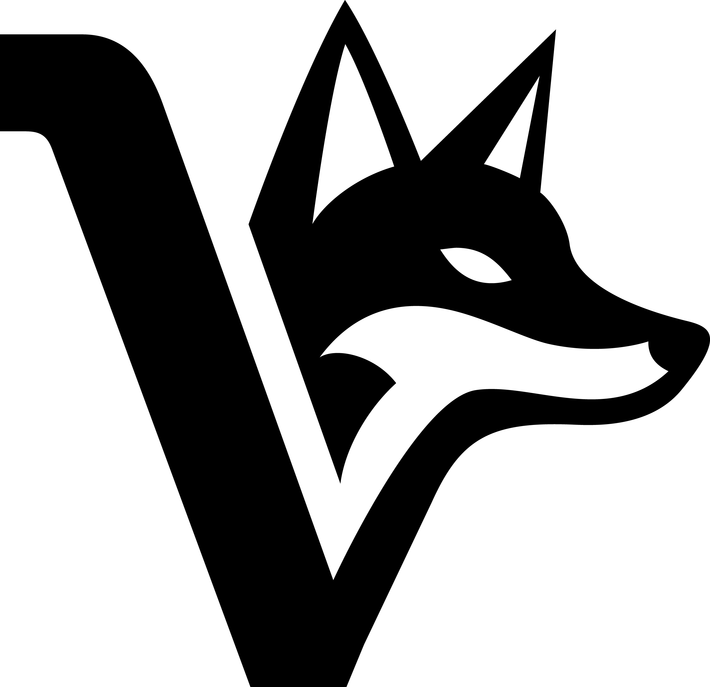

# Voxpupuli Logos

Here you can find all of logos that Voxpupuli uses

## 8bit vox

## Blue Skies

## 8bit vpci

## 8 bit vpci square

[!8bit style vpci vox square](images/8bit-vpci_head.png)

# OpenVox logos

[see here](images/OpenVox/)

# License

  Voxpupuli Logos by Shelly Coen is licensed under a <a rel="license" href="http://creativecommons.org/licenses/by-sa/4.0/">Creative Commons Attribution-ShareAlike 4.0 International License</a>. Based on a work at <a xmlns:dct="http://purl.org/dc/terms/" href="https://github.com/voxpupuli/logos" rel="dct:source">https://github.com/voxpupuli/logos</a>.

# Credits

- Thanks to [ShellyCoen](https://github.com/ShellyCoen) for the awesome work of designing our 8bit-vox
- Thanks to [Erin Balm](https://www.instagram.com/erinbalm) for the awesome crochet work on our finger puppets

# Attribution
 was generated by https://www.asciiart.eu/image-to-ascii
